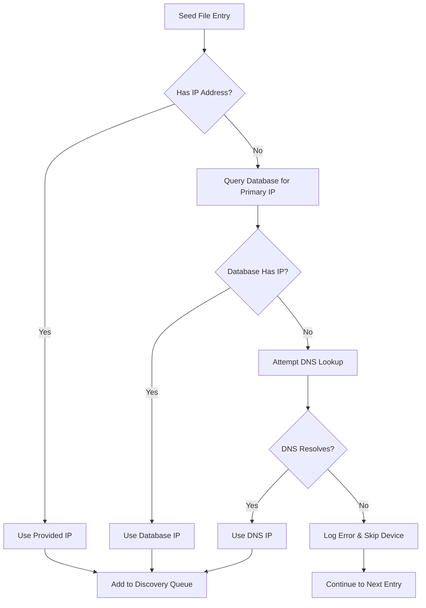
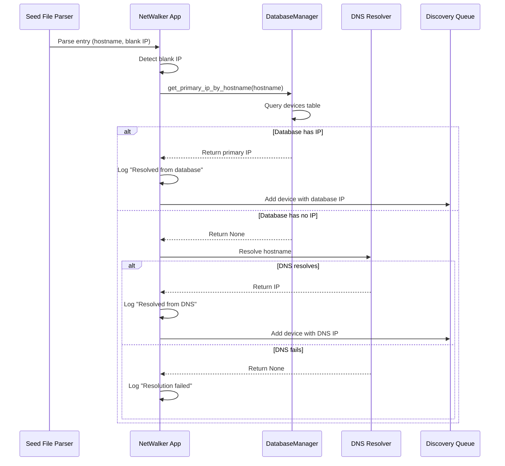

# Design Document: Database IP Lookup for Seed Devices

## Overview

This feature extends NetWalker's seed file processing to automatically resolve IP addresses for hostname-only entries by querying the database for previously discovered primary IPs. The design implements a fallback resolution chain (database → DNS → fail) that enables seamless re-discovery of devices using only their hostnames, while maintaining full backward compatibility with existing seed files that contain explicit IP addresses.

The implementation modifies the seed file parsing logic in `netwalker_app.py` to detect blank IP addresses and adds a new database query method to `DatabaseManager` for retrieving primary IPs by hostname. The resolution process is transparent to downstream components, which receive fully resolved device entries in the same format regardless of the resolution method used.

## Architecture

### High-Level Flow



### Component Interaction



### Integration Points

1. **Seed File Parser** (`_parse_seed_file()` in `netwalker_app.py`)
   - Detects blank IP addresses during CSV parsing
   - Triggers IP resolution before adding to discovery queue

2. **DatabaseManager** (`database_manager.py`)
   - New method: `get_primary_ip_by_hostname(hostname: str) -> Optional[str]`
   - Queries the `devices` table for primary IP by hostname

3. **DNS Resolver** (Python `socket.gethostbyname()`)
   - Fallback mechanism when database lookup fails
   - Standard library function, no new dependencies

4. **Discovery Queue** (existing)
   - Receives fully resolved device entries
   - No changes required to downstream processing

## Components and Interfaces

### 1. Seed File Parser Enhancement

**Location**: `netwalker_app.py::_parse_seed_file()`

**Current Behavior**:
```python
def _parse_seed_file(self, seed_file_path: str) -> List[Dict[str, str]]:
    # Parses CSV and returns list of device dicts
    # Each dict has: hostname, ip, status
```

**Enhanced Behavior**:
```python
def _parse_seed_file(self, seed_file_path: str) -> List[Dict[str, str]]:
    # Parse CSV
    for row in csv_reader:
        hostname = row['hostname']
        ip = row['ip'].strip()
        
        # NEW: Detect blank IP and resolve
        if not ip:
            ip = self._resolve_ip_for_hostname(hostname)
            if not ip:
                logger.warning(f"Could not resolve IP for {hostname}, skipping")
                continue
        
        devices.append({'hostname': hostname, 'ip': ip, 'status': status})
```

**New Method**:
```python
def _resolve_ip_for_hostname(self, hostname: str) -> Optional[str]:
    """
    Resolve IP address for hostname using fallback chain:
    1. Database lookup for primary IP
    2. DNS lookup
    3. Return None if both fail
    
    Args:
        hostname: Device hostname to resolve
        
    Returns:
        Resolved IP address or None if resolution fails
    """
    # Try database first
    ip = self.db_manager.get_primary_ip_by_hostname(hostname)
    if ip:
        logger.info(f"Resolved {hostname} to {ip} from database")
        return ip
    
    # Try DNS fallback
    try:
        ip = socket.gethostbyname(hostname)
        logger.info(f"Resolved {hostname} to {ip} from DNS")
        return ip
    except socket.gaierror:
        logger.warning(f"Failed to resolve {hostname} via database or DNS")
        return None
```

### 2. DatabaseManager Enhancement

**Location**: `cdp_walker/database_manager.py`

**New Method**:
```python
def get_primary_ip_by_hostname(self, hostname: str) -> Optional[str]:
    """
    Query database for a device's primary IP address by hostname.
    
    Args:
        hostname: Device hostname to look up
        
    Returns:
        Primary IP address if found, None otherwise
        
    Raises:
        No exceptions - returns None on any error
    """
    try:
        query = """
            SELECT primary_ip 
            FROM devices 
            WHERE hostname = ? 
            AND primary_ip IS NOT NULL 
            AND primary_ip != ''
            LIMIT 1
        """
        
        result = self.execute_query(query, (hostname,))
        
        if result and len(result) > 0:
            return result[0]['primary_ip']
        
        return None
        
    except Exception as e:
        logger.error(f"Database error looking up IP for {hostname}: {e}")
        return None
```

**Database Schema** (existing, no changes):
```sql
CREATE TABLE devices (
    hostname TEXT PRIMARY KEY,
    primary_ip TEXT,
    -- other columns...
)
```

**Index Consideration**:
The `hostname` column is already the PRIMARY KEY, so lookups are automatically indexed and efficient.

### 3. Error Handling Strategy

**Database Errors**:
- Catch all exceptions in `get_primary_ip_by_hostname()`
- Log error with hostname and exception details
- Return None to trigger DNS fallback
- Never raise exceptions to calling code

**DNS Errors**:
- Catch `socket.gaierror` for DNS resolution failures
- Log warning with hostname
- Return None to indicate complete resolution failure
- Calling code skips device and continues processing

**Seed File Processing**:
- Skip devices that cannot be resolved
- Log warning for each skipped device
- Continue processing remaining seed file entries
- Do not fail entire discovery process for individual resolution failures

## Data Models

### Seed File Entry (Input)

**CSV Format**:
```csv
hostname,ip,status
DEVICE-01,192.168.1.1,pending
DEVICE-02,,pending
DEVICE-03,10.0.0.5,pending
```

**Parsed Dictionary**:
```python
{
    'hostname': str,  # Required, non-empty
    'ip': str,        # May be empty string or whitespace
    'status': str     # Discovery status
}
```

### Resolved Device Entry (Output)

**After IP Resolution**:
```python
{
    'hostname': str,  # Original hostname
    'ip': str,        # Resolved or provided IP (non-empty)
    'status': str     # Original status
}
```

**Resolution Metadata** (logged, not stored in dict):
```python
{
    'hostname': str,
    'resolved_ip': str,
    'resolution_method': str,  # 'explicit', 'database', 'dns', or 'failed'
    'timestamp': datetime
}
```

### Database Query Result

**Query Return Type**:
```python
Optional[str]  # IP address or None
```

**Database Row** (from devices table):
```python
{
    'hostname': str,
    'primary_ip': str,  # May be NULL or empty in database
    # other fields not relevant to this query
}
```

## Correctness Properties

*A property is a characteristic or behavior that should hold true across all valid executions of a system—essentially, a formal statement about what the system should do. Properties serve as the bridge between human-readable specifications and machine-verifiable correctness guarantees.*


### Property 1: Blank IP Detection

*For any* seed file entry, if the IP field is empty or contains only whitespace, the parser should flag it for resolution; if the IP field contains a non-whitespace value, the parser should not trigger resolution.

**Validates: Requirements 1.1, 1.2, 1.3**

### Property 2: Database Lookup Returns Stored IP

*For any* hostname that exists in the database with a non-null, non-empty primary IP, querying the database should return that exact IP address.

**Validates: Requirements 2.2**

### Property 3: Database Lookup Returns None for Missing Entries

*For any* hostname that does not exist in the database or has a null/empty primary IP, querying the database should return None.

**Validates: Requirements 2.3**

### Property 4: Resolution Fallback Chain Order

*For any* hostname requiring resolution, the system should attempt database lookup first, and only attempt DNS lookup if the database returns None.

**Validates: Requirements 2.1, 3.1, 3.2**

### Property 5: Complete Resolution Failure Handling

*For any* hostname that cannot be resolved by either database or DNS, the system should skip the device and continue processing remaining entries.

**Validates: Requirements 3.3**

### Property 6: Resolved IP Usage

*For any* hostname that is successfully resolved (via database or DNS), the resolved IP should appear in the discovery queue entry for that device.

**Validates: Requirements 3.4, 7.1**

### Property 7: Database Resolution Logging

*For any* hostname resolved via database lookup, the log should contain an INFO-level message indicating "database" as the resolution source and include both the hostname and resolved IP.

**Validates: Requirements 4.1, 4.4**

### Property 8: DNS Resolution Logging

*For any* hostname resolved via DNS lookup, the log should contain an INFO-level message indicating "DNS" as the resolution source and include both the hostname and resolved IP.

**Validates: Requirements 4.2, 4.4**

### Property 9: Resolution Failure Logging

*For any* hostname that fails to resolve via both database and DNS, the log should contain a WARNING-level message with the hostname.

**Validates: Requirements 4.3, 4.5**

### Property 10: Explicit IP Bypass

*For any* seed file entry with a non-empty IP address, the system should use the provided IP without querying the database or performing DNS lookup.

**Validates: Requirements 5.1**

### Property 11: Mixed Seed File Processing

*For any* seed file containing a mix of entries with and without IP addresses, each entry should be processed according to its IP presence (explicit IPs used directly, blank IPs resolved).

**Validates: Requirements 5.3**

### Property 12: Explicit IP Preservation

*For any* seed file entry with an explicit IP address, the IP in the discovery queue should exactly match the IP from the seed file.

**Validates: Requirements 5.4**

### Property 13: Database Error Handling

*For any* database query that fails (connection error, query error, or any exception), the DatabaseManager should return None without raising exceptions.

**Validates: Requirements 6.1, 6.2, 6.4**

### Property 14: Database Error Fallback

*For any* hostname where database lookup fails with an error, the system should proceed to attempt DNS lookup.

**Validates: Requirements 6.3**

### Property 15: Attribute Preservation

*For any* seed file entry that undergoes IP resolution, all non-IP attributes (hostname, status) should be preserved unchanged in the discovery queue entry.

**Validates: Requirements 7.2**

### Property 16: Format Consistency

*For any* two devices in the discovery queue (one with explicit IP, one with resolved IP), their data structure format should be identical.

**Validates: Requirements 7.3**

### Property 17: Entry Order Preservation

*For any* seed file with multiple entries, the order of devices in the discovery queue should match the order in the seed file (excluding skipped devices).

**Validates: Requirements 7.4**

## Error Handling

### Database Errors

**Error Types**:
1. Connection errors (database unavailable, connection timeout)
2. Query errors (malformed query, database corruption)
3. Unexpected exceptions (any other error)

**Handling Strategy**:
```python
def get_primary_ip_by_hostname(self, hostname: str) -> Optional[str]:
    try:
        # Query execution
        result = self.execute_query(query, (hostname,))
        return result[0]['primary_ip'] if result else None
    except sqlite3.OperationalError as e:
        logger.error(f"Database connection error for {hostname}: {e}")
        return None
    except sqlite3.DatabaseError as e:
        logger.error(f"Database query error for {hostname}: {e}")
        return None
    except Exception as e:
        logger.error(f"Unexpected error looking up {hostname}: {e}")
        return None
```

**Recovery**: All database errors return None, triggering DNS fallback.

### DNS Errors

**Error Types**:
1. `socket.gaierror`: Hostname cannot be resolved
2. `socket.timeout`: DNS server timeout
3. Network errors: No network connectivity

**Handling Strategy**:
```python
def _resolve_ip_for_hostname(self, hostname: str) -> Optional[str]:
    # Try database first...
    
    # Try DNS fallback
    try:
        ip = socket.gethostbyname(hostname)
        logger.info(f"Resolved {hostname} to {ip} from DNS")
        return ip
    except socket.gaierror as e:
        logger.warning(f"DNS resolution failed for {hostname}: {e}")
        return None
    except socket.timeout as e:
        logger.warning(f"DNS timeout for {hostname}: {e}")
        return None
    except Exception as e:
        logger.warning(f"Unexpected DNS error for {hostname}: {e}")
        return None
```

**Recovery**: DNS errors return None, causing the device to be skipped.

### Seed File Processing Errors

**Error Types**:
1. Complete resolution failure (both database and DNS fail)
2. Malformed seed file entries
3. Empty hostname field

**Handling Strategy**:
- Skip devices that cannot be resolved
- Log warning for each skipped device with reason
- Continue processing remaining entries
- Do not fail entire discovery process

**Example**:
```python
for row in csv_reader:
    hostname = row.get('hostname', '').strip()
    if not hostname:
        logger.warning("Skipping entry with empty hostname")
        continue
    
    ip = row.get('ip', '').strip()
    if not ip:
        ip = self._resolve_ip_for_hostname(hostname)
        if not ip:
            logger.warning(f"Skipping {hostname}: could not resolve IP")
            continue
    
    devices.append({'hostname': hostname, 'ip': ip, 'status': status})
```

### Logging Strategy

**Log Levels**:
- **INFO**: Successful IP resolution (database or DNS)
- **WARNING**: Resolution failures, skipped devices
- **ERROR**: Database errors, unexpected exceptions

**Log Format**:
```
INFO: Resolved DEVICE-01 to 192.168.1.1 from database
INFO: Resolved DEVICE-02 to 10.0.0.5 from DNS
WARNING: Failed to resolve DEVICE-03 via database or DNS
WARNING: Skipping DEVICE-03: could not resolve IP
ERROR: Database error looking up IP for DEVICE-04: connection timeout
```

## Testing Strategy

### Dual Testing Approach

This feature requires both unit tests and property-based tests to ensure comprehensive coverage:

**Unit Tests** focus on:
- Specific examples of blank IP detection (empty string, whitespace variations)
- Database query with known test data
- DNS resolution with mock responses
- Error handling with simulated failures
- Integration between components

**Property Tests** focus on:
- Universal properties across all possible inputs
- Randomized seed file entries with various IP formats
- Randomized hostnames and IP addresses
- Fallback chain behavior across many scenarios
- Attribute preservation across random data

### Property-Based Testing Configuration

**Library**: Use `hypothesis` for Python property-based testing

**Configuration**:
- Minimum 100 iterations per property test
- Each test tagged with feature name and property number
- Tag format: `# Feature: database-ip-lookup-for-seed-devices, Property N: [property text]`

**Example Property Test Structure**:
```python
from hypothesis import given, strategies as st
import pytest

@given(
    hostname=st.text(min_size=1, max_size=50),
    ip=st.one_of(st.none(), st.ip_addresses(v=4).map(str))
)
@pytest.mark.property_test
def test_database_lookup_returns_stored_ip(hostname, ip):
    """
    Feature: database-ip-lookup-for-seed-devices, Property 2
    For any hostname with stored IP, database lookup returns that IP
    """
    # Setup: Store IP in database
    if ip:
        db_manager.store_primary_ip(hostname, ip)
    
    # Test: Query should return stored IP
    result = db_manager.get_primary_ip_by_hostname(hostname)
    
    # Verify
    if ip:
        assert result == ip
    else:
        assert result is None
```

### Unit Test Coverage

**Test Cases**:
1. Blank IP detection with various whitespace patterns
2. Database lookup with existing hostname
3. Database lookup with non-existent hostname
4. DNS fallback when database returns None
5. Complete resolution failure handling
6. Explicit IP bypass (no resolution triggered)
7. Mixed seed file processing
8. Database connection error handling
9. DNS resolution error handling
10. Attribute preservation during resolution
11. Entry order preservation
12. Log message verification for each resolution method

**Test Data**:
- Sample seed files with various IP patterns
- Mock database with known hostname-IP mappings
- Mock DNS resolver with controlled responses
- Error injection for database and DNS failures

### Integration Testing

**Test Scenarios**:
1. End-to-end seed file processing with database-stored IPs
2. End-to-end seed file processing with DNS resolution
3. Mixed seed file with explicit IPs, database IPs, and DNS IPs
4. Database unavailable scenario (DNS fallback)
5. Complete resolution failure scenario (device skipped)
6. Large seed file performance (100+ entries)

**Validation**:
- Discovery queue contains correct devices with resolved IPs
- Skipped devices are logged appropriately
- Resolution methods are logged correctly
- No exceptions propagate to calling code
- Backward compatibility with existing seed files

### Test Execution

**Unit Tests**: Run with pytest
```bash
pytest tests/unit/test_ip_resolution.py -v
```

**Property Tests**: Run with pytest and hypothesis
```bash
pytest tests/property/test_ip_resolution_properties.py -v --hypothesis-show-statistics
```

**Integration Tests**: Run with pytest
```bash
pytest tests/integration/test_seed_file_processing.py -v
```

**Coverage Target**: Minimum 90% code coverage for new and modified code
