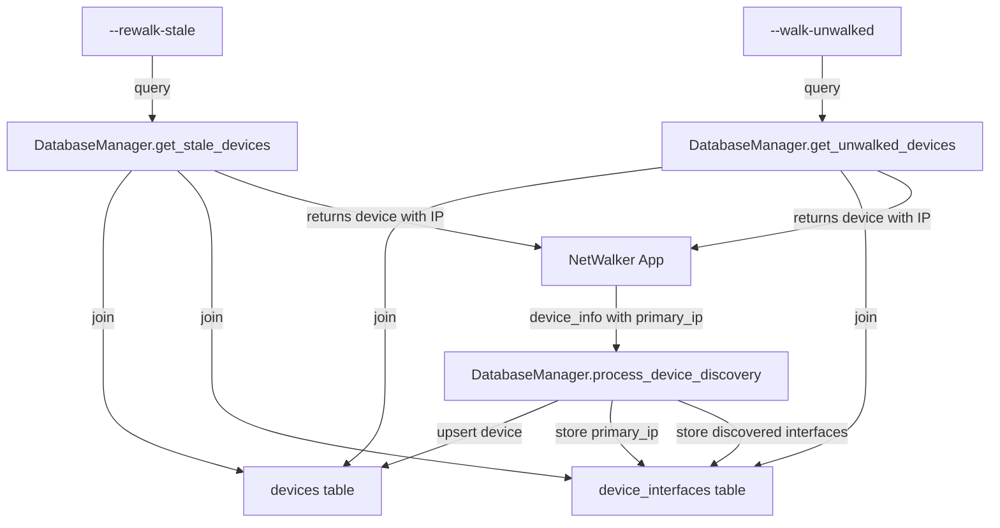

# Design Document: Database Primary IP Storage

## Overview

This feature adds storage of the primary management IP address used during initial device discovery to the database. Currently, when devices are discovered via hostname-only seed file entries, the IP address used to connect is not stored, causing database-driven reconnection features (--rewalk-stale and --walk-unwalked) to fail. By storing the primary_ip as a management interface during discovery, we ensure that all devices have at least one valid IP address available for reconnection.

The solution leverages the existing device_interfaces table and requires minimal changes to the database schema. The primary_ip will be stored with interface_type='management' to distinguish it from other interface types.

## Architecture

### Current Flow (Problem)
1. User provides seed file with hostname-only entry (e.g., "router1")
2. NetWalker resolves hostname and connects using resolved IP
3. Device discovery completes, stores device info and interfaces
4. **Primary IP is NOT stored** - only discovered interfaces are stored
5. Later, --rewalk-stale queries database for device
6. Query returns device_name but no IP address (no interfaces stored)
7. Connection attempt fails: "Either ip or host must be set"

### Proposed Flow (Solution)
1. User provides seed file with hostname-only entry (e.g., "router1")
2. NetWalker resolves hostname and connects using resolved IP
3. Device discovery completes, stores device info and interfaces
4. **Primary IP IS stored** as management interface with interface_type='management'
5. Later, --rewalk-stale queries database for device
6. Query returns device_name AND primary_ip from device_interfaces
7. Connection attempt succeeds using stored primary_ip

### Component Interaction



## Components and Interfaces

### Modified Component: DatabaseManager.process_device_discovery()

**Current Signature:**
```python
def process_device_discovery(self, device_info: Dict[str, Any]) -> bool
```

**Behavior Changes:**
1. Extract primary_ip from device_info dictionary
2. Validate primary_ip is not None and not empty
3. Create interface record for primary_ip before processing other interfaces
4. Store primary_ip with interface_type='management' and interface_name='Primary Management'

**Input (device_info dictionary):**
- `primary_ip` (str): The IP address used to connect to the device
- `hostname` (str): Device hostname
- `serial_number` (str): Device serial number
- `interfaces` (list): Discovered interface information
- Other existing fields...

**Logic Flow:**
```python
def process_device_discovery(self, device_info: Dict[str, Any]) -> bool:
    # 1. Upsert device (existing)
    device_id = self.upsert_device(device_info)
    
    # 2. NEW: Store primary_ip as management interface
    primary_ip = device_info.get('primary_ip')
    if primary_ip:
        primary_interface = {
            'interface_name': 'Primary Management',
            'ip_address': primary_ip,
            'subnet_mask': '',
            'interface_type': 'management'
        }
        self.upsert_device_interface(device_id, primary_interface)
    
    # 3. Store software version (existing)
    # 4. Store discovered interfaces (existing)
    # 5. Store VLANs (existing)
    # 6. Store neighbors (existing)
```

### Existing Component: DatabaseManager.upsert_device_interface()

**No changes required** - this method already supports interface_type parameter and handles upsert logic correctly.

**Current Signature:**
```python
def upsert_device_interface(self, device_id: int, interface_info: Dict[str, Any]) -> bool
```

**Existing Behavior:**
- Checks for existing interface by (device_id, interface_name, ip_address)
- Updates last_seen if exists
- Inserts new record if doesn't exist
- Handles interface_type field

### Existing Component: DatabaseManager.get_stale_devices()

**No changes required** - this method already queries device_interfaces and will automatically return the primary_ip once stored.

**Current Query Logic:**
```sql
SELECT TOP 1 ip_address 
FROM device_interfaces 
WHERE device_id = d.device_id 
ORDER BY 
    CASE 
        WHEN interface_name LIKE '%Management%' THEN 1
        WHEN interface_name LIKE '%Loopback%' THEN 2
        WHEN interface_name LIKE '%Vlan%' THEN 3
        ELSE 4
    END,
    interface_name
```

**Why it works:**
- The query prioritizes interfaces with 'Management' in the name (priority 1)
- Our primary_ip will be stored with interface_name='Primary Management'
- This will be selected first due to the ORDER BY clause

### Existing Component: DatabaseManager.get_unwalked_devices()

**No changes required** - uses identical query logic to get_stale_devices(), will automatically benefit from primary_ip storage.

## Data Models

### Existing Table: device_interfaces

**Schema (no changes required):**
```sql
CREATE TABLE device_interfaces (
    interface_id INT IDENTITY(1,1) PRIMARY KEY,
    device_id INT NOT NULL,
    interface_name NVARCHAR(100) NOT NULL,
    ip_address NVARCHAR(50) NOT NULL,
    subnet_mask NVARCHAR(50) NULL,
    interface_type NVARCHAR(50) NULL,
    first_seen DATETIME2 NOT NULL DEFAULT GETDATE(),
    last_seen DATETIME2 NOT NULL DEFAULT GETDATE(),
    created_at DATETIME2 NOT NULL DEFAULT GETDATE(),
    updated_at DATETIME2 NOT NULL DEFAULT GETDATE(),
    CONSTRAINT FK_device_interfaces_device FOREIGN KEY (device_id) 
        REFERENCES devices(device_id) ON DELETE CASCADE,
    CONSTRAINT UQ_device_interface_ip UNIQUE (device_id, interface_name, ip_address)
);
```

**Primary IP Record Format:**
- `interface_name`: 'Primary Management'
- `ip_address`: The IP used to connect (from device_info['primary_ip'])
- `subnet_mask`: '' (empty, not available during initial connection)
- `interface_type`: 'management'

**Uniqueness Constraint:**
The existing UNIQUE constraint (device_id, interface_name, ip_address) ensures:
- No duplicate primary_ip records per device
- If primary_ip changes on rediscovery, a new record is created
- Old primary_ip records remain for historical tracking

### Interface Type Values

**Existing Types:**
- Various types from discovered interfaces (e.g., 'physical', 'vlan', 'loopback')

**New Type:**
- 'management': Indicates the primary management IP used for device access

## Correctness Properties

*A property is a characteristic or behavior that should hold true across all valid executions of a system—essentially, a formal statement about what the system should do. Properties serve as the bridge between human-readable specifications and machine-verifiable correctness guarantees.*


### Property 1: Primary IP Storage Completeness
*For any* device with a valid primary_ip in device_info, when process_device_discovery() is called, the primary_ip should be stored in device_interfaces with interface_name='Primary Management', interface_type='management', and associated with the correct device_id.
**Validates: Requirements 1.1, 1.2, 1.3, 4.2**

### Property 2: Primary IP Storage Idempotence
*For any* device, storing the same primary_ip multiple times should result in only one record in device_interfaces (update existing rather than create duplicates), with last_seen timestamp updated.
**Validates: Requirements 1.4**

### Property 3: Database Query Returns Valid IPs
*For any* device returned by get_stale_devices() or get_unwalked_devices(), the ip_address field should not be empty, and if a primary_ip exists in device_interfaces, it should be prioritized over other interface types.
**Validates: Requirements 2.1, 2.2, 2.3, 2.4**

### Property 4: IP Address Format Validation
*For any* primary_ip value, if it is not in valid IP address format (IPv4 or IPv6), the storage operation should either reject it or log a warning, ensuring only valid IP addresses are stored in device_interfaces.
**Validates: Requirements 4.1**

### Property 5: Primary IP Update on Rediscovery
*For any* device that is rediscovered with a different primary_ip, the new primary_ip should be stored (creating a new record), and the device should be retrievable using the most recent primary_ip.
**Validates: Requirements 4.3**

## Error Handling

### Primary IP Extraction Errors
- **Missing primary_ip**: If device_info does not contain primary_ip field, log a debug message and continue processing (device may have been discovered via IP directly)
- **Empty primary_ip**: If primary_ip is empty string or None, skip primary_ip storage but continue with other discovery processing
- **Invalid IP format**: Log a warning if primary_ip is not a valid IP address format, but still attempt to store (database will handle validation)

### Database Storage Errors
- **Duplicate key violations**: Should not occur due to upsert logic, but if they do, log error and continue
- **Foreign key violations**: If device_id is invalid, log error and fail the entire discovery process (indicates serious data integrity issue)
- **Connection errors**: If database connection is lost during storage, log error and return False from process_device_discovery()

### Query Errors
- **No IP addresses available**: If a device has no interfaces stored (legacy data), the COALESCE query returns empty string, which should be handled by the calling code
- **Connection errors**: If database connection fails during query, return empty list and log error

### Backward Compatibility
- **Legacy devices without primary_ip**: Existing devices in the database will not have primary_ip records. The query logic already handles this with COALESCE and will return any available interface IP
- **Empty IP address results**: Calling code (NetWalker app) should validate that returned devices have non-empty ip_address before attempting connection

## Testing Strategy

This feature will use a dual testing approach combining unit tests for specific scenarios and property-based tests for universal correctness properties.

### Unit Tests
Unit tests will focus on specific examples and integration points:

1. **Primary IP Storage Example**
   - Create a device_info with specific primary_ip
   - Call process_device_discovery()
   - Verify primary_ip is stored in device_interfaces with correct fields

2. **Query Integration Example**
   - Store a device with only primary_ip (no other interfaces)
   - Call get_stale_devices() or get_unwalked_devices()
   - Verify the device is returned with the primary_ip

3. **Backward Compatibility Example**
   - Query a device that was stored before this feature (no primary_ip)
   - Verify the query returns any available interface IP or empty string
   - Verify no errors or exceptions occur

4. **Connection Manager Integration Example**
   - Get devices from database query
   - Pass to Connection Manager
   - Verify Connection Manager accepts the device format

### Property-Based Tests
Property tests will verify universal correctness across many generated inputs. Each test will run a minimum of 100 iterations.

1. **Property Test: Primary IP Storage Completeness**
   - **Tag**: Feature: database-primary-ip-storage, Property 1: Primary IP Storage Completeness
   - **Generator**: Random device_info dictionaries with valid primary_ip values
   - **Test**: For each generated device_info, call process_device_discovery(), then query device_interfaces and verify primary_ip is stored with correct interface_type and interface_name
   - **Validates**: Requirements 1.1, 1.2, 1.3, 4.2

2. **Property Test: Primary IP Storage Idempotence**
   - **Tag**: Feature: database-primary-ip-storage, Property 2: Primary IP Storage Idempotence
   - **Generator**: Random device_info dictionaries
   - **Test**: For each generated device_info, call process_device_discovery() twice with same primary_ip, then verify only one record exists in device_interfaces for that primary_ip
   - **Validates**: Requirements 1.4

3. **Property Test: Database Query Returns Valid IPs**
   - **Tag**: Feature: database-primary-ip-storage, Property 3: Database Query Returns Valid IPs
   - **Generator**: Random devices with various interface configurations (only primary_ip, multiple interfaces, etc.)
   - **Test**: Store devices, mark as stale/unwalked, query using get_stale_devices()/get_unwalked_devices(), verify all returned devices have non-empty ip_address and primary_ip is prioritized
   - **Validates**: Requirements 2.1, 2.2, 2.3, 2.4

4. **Property Test: IP Address Format Validation**
   - **Tag**: Feature: database-primary-ip-storage, Property 4: IP Address Format Validation
   - **Generator**: Random strings including valid IPs, invalid IPs, and edge cases
   - **Test**: For each generated string, attempt to store as primary_ip, verify only valid IP formats are stored or appropriate warnings are logged
   - **Validates**: Requirements 4.1

5. **Property Test: Primary IP Update on Rediscovery**
   - **Tag**: Feature: database-primary-ip-storage, Property 5: Primary IP Update on Rediscovery
   - **Generator**: Random device_info with different primary_ip values
   - **Test**: Store device with primary_ip1, then rediscover with primary_ip2, verify both records exist and queries return the most recent one
   - **Validates**: Requirements 4.3

### Test Configuration
- **Property test library**: pytest with hypothesis (Python property-based testing library)
- **Minimum iterations**: 100 per property test
- **Database**: Use test database or in-memory SQLite for faster test execution
- **Test data cleanup**: Each test should clean up its data to avoid interference

### Edge Cases to Test
- Empty primary_ip field in device_info
- None value for primary_ip
- Device with no interfaces at all (only primary_ip)
- Device with many interfaces including primary_ip
- Legacy devices without primary_ip (backward compatibility)
- Invalid IP address formats (malformed strings)
- Duplicate primary_ip storage attempts
- Database connection failures during storage
- Query results when no devices match criteria

### Integration Testing
- Test complete flow: seed file → discovery → storage → query → reconnection
- Verify --rewalk-stale successfully reconnects to devices discovered via hostname
- Verify --walk-unwalked successfully walks neighbors discovered via hostname
- Test with real network devices (if available) or mocked connections
