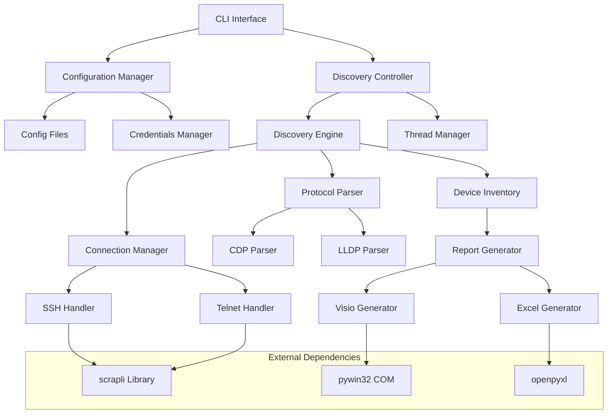

# Design Document: Network Topology Discovery

## Overview

The NetWalker Tool is a modular Python application designed for automated Cisco network topology discovery and documentation. The system employs a breadth-first discovery algorithm to systematically explore network infrastructure using CDP and LLDP protocols, generating comprehensive reports in Excel and Microsoft Visio formats.

The architecture follows a modular design with clear separation of concerns, enabling concurrent processing, flexible configuration management, and robust error handling. The system is specifically designed for Windows environments and leverages industry-standard libraries including scrapli for network connectivity and pywin32 for Microsoft Office integration.

## Architecture

The system follows a layered architecture with the following key components:



### Core Components

1. **Discovery Controller**: Orchestrates the overall discovery process and manages concurrent operations
2. **Configuration Manager**: Handles INI file processing, CLI argument parsing, and credential management
3. **Discovery Engine**: Implements breadth-first traversal algorithm and manages device discovery queue
4. **Connection Manager**: Abstracts SSH/Telnet connectivity using scrapli library
5. **Protocol Parser**: Extracts neighbor information from CDP and LLDP command outputs
6. **Device Inventory**: Maintains discovered device information and relationship mappings
7. **Report Generator**: Creates Excel and Visio documentation from discovery data

## Components and Interfaces

### Configuration Manager

**Purpose**: Centralized configuration handling with support for INI files, CLI overrides, and secure credential management.

**Key Methods**:
- `load_configuration()`: Loads settings from netwalker.ini with CLI overrides
- `get_credentials()`: Retrieves authentication credentials with encryption support
- `create_default_config()`: Generates default configuration file with all options
- `encrypt_credentials()`: Converts plain text credentials to MD5 encrypted format

**Configuration Structure**:
```ini
[discovery]
max_depth = 10
concurrent_connections = 5
connection_timeout = 30
discovery_protocols = CDP,LLDP

[filtering]
include_wildcards = *
exclude_wildcards = 
include_cidrs = 
exclude_cidrs = 

[exclusions]
exclude_hostnames = LUMT*, LUMV*
exclude_ip_ranges = 10.70.0.0/16
exclude_platforms = linux, windows, unix, freebsd, openbsd, netbsd, solaris, aix, hp-ux, vmware, docker, kubernetes, phone, host phone, camera, printer, access point, wireless, server
exclude_capabilities = host phone, phone, camera, printer, server

[output]
reports_directory = .\reports
logs_directory = .\logs
excel_format = xlsx
visio_enabled = true

[connection]
ssh_port = 22
telnet_port = 23
preferred_method = ssh
```

### Discovery Engine

**Purpose**: Implements breadth-first network traversal with concurrent processing capabilities.

**Key Methods**:
- `start_discovery(seed_devices)`: Initiates discovery from seed device list
- `process_device(device_info)`: Connects to device and extracts neighbor information
- `apply_filters(device_list)`: Applies wildcard and CIDR filtering rules
- `manage_discovery_queue()`: Maintains breadth-first processing order

**Discovery Algorithm**:
1. Initialize queue with seed devices at depth 0
2. Process devices concurrently with configurable thread pool
3. Extract neighbor information using protocol parsers
4. Apply filtering rules to determine discovery boundaries
5. Add unfiltered neighbors to queue at depth + 1
6. Continue until queue empty or max depth reached

### Connection Manager

**Purpose**: Abstracts network device connectivity with automatic SSH/Telnet fallback.

**Key Methods**:
- `connect_device(host, credentials)`: Establishes connection with fallback logic
- `execute_command(command)`: Sends command and returns output
- `close_connection()`: Properly terminates session with exit commands
- `detect_platform()`: Identifies device platform using "show version"

**Connection Flow**:
```python
def connect_device(self, host, credentials):
    try:
        # Attempt SSH connection first
        conn = Scrapli(
            host=host,
            auth_username=credentials.username,
            auth_password=credentials.password,
            platform="cisco_iosxe",
            transport="ssh2"
        )
        conn.open()
        return conn, "SSH"
    except Exception:
        # Fallback to Telnet
        conn = Scrapli(
            host=host,
            auth_username=credentials.username,
            auth_password=credentials.password,
            platform="cisco_iosxe",
            transport="telnet"
        )
        conn.open()
        return conn, "Telnet"
```

### Protocol Parser

**Purpose**: Extracts structured neighbor information from CDP and LLDP command outputs.

**Key Methods**:
- `parse_cdp_neighbors(output)`: Parses "show cdp neighbors detail" output
- `parse_lldp_neighbors(output)`: Parses "show lldp neighbors detail" output
- `extract_hostname(neighbor_entry)`: Extracts device hostname from neighbor data
- `normalize_neighbor_info(raw_data)`: Converts raw output to structured format

**Parsing Strategy**:
- Uses regular expressions for reliable text extraction
- Handles platform-specific output variations (IOS/IOS-XE/NX-OS)
- Normalizes neighbor information to common data structure
- Validates extracted data for completeness and accuracy

### Device Inventory

**Purpose**: Maintains comprehensive device information and relationship mappings.

**Data Structure**:
```python
@dataclass
class DeviceInfo:
    hostname: str
    primary_ip: str
    platform: str
    capabilities: List[str]
    software_version: str
    vtp_version: str
    serial_number: str
    hardware_model: str
    uptime: str
    discovery_timestamp: datetime
    discovery_depth: int
    is_seed: bool
    connection_method: str
    connection_status: str
    error_details: Optional[str]
    neighbors: List[NeighborInfo]
```

### Report Generator

**Purpose**: Creates professional documentation in Excel and Visio formats.

**Excel Generation**:
- Consolidated connections sheet with all device relationships
- Master inventory sheet with complete device information
- Individual device sheets with detailed neighbor information
- Professional formatting with headers, filters, and auto-sizing
- Timestamp-based file naming convention

**Visio Generation**:
- Uses pywin32 COM interface exclusively
- Creates network topology diagrams from scratch
- Represents devices as shapes with connection lines
- Includes device information in shape properties
- Proper COM resource cleanup after operations

## Data Models

### Core Data Structures

```python
@dataclass
class NeighborInfo:
    device_id: str
    local_interface: str
    remote_interface: str
    platform: str
    capabilities: List[str]
    ip_address: Optional[str]
    
@dataclass
class ConnectionInfo:
    source_device: str
    source_interface: str
    target_device: str
    target_interface: str
    protocol: str  # CDP or LLDP
    
@dataclass
class DiscoverySession:
    session_id: str
    start_time: datetime
    seed_devices: List[str]
    discovered_devices: Dict[str, DeviceInfo]
    connections: List[ConnectionInfo]
    errors: List[str]
    status: str  # running, completed, failed
```

### Configuration Data Models

```python
@dataclass
class DiscoveryConfig:
    max_depth: int
    concurrent_connections: int
    connection_timeout: int
    protocols: List[str]
    
@dataclass
class FilterConfig:
    include_wildcards: List[str]
    exclude_wildcards: List[str]
    include_cidrs: List[str]
    exclude_cidrs: List[str]
    
@dataclass
class OutputConfig:
    reports_directory: str
    logs_directory: str
    excel_format: str
    visio_enabled: bool
```

Now I need to use the prework tool to analyze the acceptance criteria before writing the correctness properties:

## Correctness Properties

*A property is a characteristic or behavior that should hold true across all valid executions of a system-essentially, a formal statement about what the system should do. Properties serve as the bridge between human-readable specifications and machine-verifiable correctness guarantees.*

After analyzing the acceptance criteria, I've identified the following testable properties that can be validated through property-based testing:

### Discovery Engine Properties

**Property 1: Neighbor Information Extraction**
*For any* device with CDP/LLDP neighbors, when the Discovery_Engine connects and extracts neighbor information, all available neighbor data should be correctly parsed and structured
**Validates: Requirements 1.1**

**Property 2: Breadth-First Traversal Order**
*For any* network topology, when discovery is performed, devices should be discovered in breadth-first order with correct depth level assignments
**Validates: Requirements 1.3**

**Property 3: Discovery Depth Boundary Enforcement**
*For any* configured depth limit, when discovery is performed, no devices should be discovered beyond the specified depth limit
**Validates: Requirements 1.5**

**Property 4: Error Isolation and Continuation**
*For any* discovery session with connection failures, when some devices fail to connect, the system should continue processing remaining devices and log all failures
**Validates: Requirements 1.4**

### Connection Management Properties

**Property 5: SSH Priority and Telnet Fallback**
*For any* device connection attempt, SSH should always be attempted first, and if SSH fails, Telnet should be attempted as fallback
**Validates: Requirements 2.1, 2.2**

**Property 6: Connection Method Recording**
*For any* successful device connection, the connection method (SSH or Telnet) should be accurately recorded in the device inventory
**Validates: Requirements 2.3**

**Property 7: Proper Connection Termination**
*For any* established device connection, when terminating the session, exit commands should be sent to ensure clean disconnection
**Validates: Requirements 2.4**

**Property 8: Windows TELNET Transport Compatibility**
*For any* TELNET connection attempt on Windows platform, the connection should use a Windows-compatible transport mechanism
**Validates: Requirements 2.6**

### Data Collection Properties

**Property 9: Complete Device Information Collection**
*For any* successfully connected device, all required device information (hostname/IP, platform, software version, serial number, hardware model, uptime) should be collected and recorded
**Validates: Requirements 3.1, 3.2, 3.3, 3.4**

**Property 10: Discovery Metadata Recording**
*For any* device discovery operation, discovery timestamp and depth level should be accurately recorded with the device information
**Validates: Requirements 3.5**

**Property 11: Status and Error Recording**
*For any* device discovery attempt, success/failure status and error details (if applicable) should be recorded in the device inventory
**Validates: Requirements 3.6**

### Filtering Properties

**Property 12: Wildcard Name Filtering**
*For any* configured wildcard pattern and discovered device name, the filtering logic should correctly match or exclude devices based on the pattern
**Validates: Requirements 4.1**

**Property 13: CIDR Range Filtering**
*For any* configured CIDR range and device IP address, the filtering logic should correctly determine inclusion or exclusion based on IP range membership
**Validates: Requirements 4.2**

**Property 14: Filter Boundary Behavior**
*For any* device matching filter criteria, the device should be included in inventory but excluded from further discovery traversal
**Validates: Requirements 4.3, 4.5**

### Report Generation Properties

**Property 15: Excel Report Completeness**
*For any* discovery session, generated Excel reports should include all discovered devices, connections, and neighbor details in appropriately formatted sheets
**Validates: Requirements 5.1, 5.2, 5.3**

**Property 16: Excel Formatting Standards**
*For any* generated Excel file, professional formatting including headers, filters, and auto-sizing should be applied consistently
**Validates: Requirements 5.4**

**Property 17: Timestamp-Based File Naming**
*For any* generated output file, the filename should follow the YYYYMMDD-HH-MM timestamp format
**Validates: Requirements 5.6, 12.5**

### Visio Integration Properties

**Property 18: COM Interface Exclusivity**
*For any* Visio operation, only the pywin32 COM interface should be used without any external library dependencies
**Validates: Requirements 6.1**

**Property 19: Visio Installation Validation**
*For any* Visio output request when Microsoft Visio is not installed, the system should fail cleanly with appropriate error messaging
**Validates: Requirements 6.2**

**Property 20: COM Resource Cleanup**
*For any* Visio operation sequence, all COM resources should be properly released and cleaned up after completion
**Validates: Requirements 6.4**

### Configuration Management Properties

**Property 21: Configuration Loading and Override**
*For any* combination of INI file settings and CLI options, CLI options should take precedence over INI file settings
**Validates: Requirements 7.2**

**Property 22: Default Configuration Completeness**
*For any* default configuration creation, all available options with descriptions should be included in the generated netwalker.ini file
**Validates: Requirements 7.4**

**Property 23: Credential Format Support**
*For any* credential configuration (encrypted or plain text), the system should correctly process and use the credentials for authentication
**Validates: Requirements 7.5**

### Security Properties

**Property 24: Automatic Credential Encryption**
*For any* plain text credentials in configuration files, the system should encrypt them using MD5 and remove the plain text versions
**Validates: Requirements 8.2**

**Property 25: Credential Exposure Prevention**
*For any* system output (logs, documentation, CLI), credentials should never be exposed in plain text
**Validates: Requirements 8.3, 8.4**

### DNS and Address Resolution Properties

**Property 26: Public IP Address Resolution**
*For any* device with a public IP address, the system should attempt DNS resolution to obtain a private address
**Validates: Requirements 9.1**

**Property 27: DNS Validation Completeness**
*For any* device, both forward and reverse DNS lookups should be tested and results recorded in the DNS report
**Validates: Requirements 9.2**

### Concurrent Processing Properties

**Property 28: Connection Limit Enforcement**
*For any* concurrent discovery operation, the number of simultaneous connections should not exceed the configured limit
**Validates: Requirements 10.2**

**Property 29: Thread Safety Maintenance**
*For any* concurrent processing operation, shared data structures should remain consistent and thread-safe
**Validates: Requirements 10.3**

### Platform Detection Properties

**Property 30: Platform Detection Command Execution**
*For any* device connection, the "show version" command should be executed for platform detection
**Validates: Requirements 11.1**

**Property 31: Multi-Protocol Parsing Support**
*For any* device with neighbor information, both CDP and LLDP protocol outputs should be parsed when available
**Validates: Requirements 11.3**

### Output Directory Management Properties

**Property 32: Configurable Output Directory Usage**
*For any* configured output directory, generated files should be written to the specified location
**Validates: Requirements 12.1, 12.2**

**Property 33: Default Directory Behavior**
*For any* system execution without specified output directories, files should be written to default .\reports and .\logs directories
**Validates: Requirements 12.3**

**Property 34: Automatic Directory Creation**
*For any* specified output directory that doesn't exist, the directory should be created automatically before file generation
**Validates: Requirements 12.4**

## Error Handling

The system implements comprehensive error handling across all components to ensure robust operation in diverse network environments:

### Connection Error Handling
- **SSH/Telnet Failures**: Automatic fallback from SSH to Telnet with detailed error logging
- **Authentication Failures**: Secure error logging without credential exposure
- **Timeout Handling**: Configurable connection timeouts with graceful failure recovery
- **Network Unreachable**: Proper handling of unreachable devices with continued processing

### Discovery Error Handling
- **Protocol Parsing Failures**: Graceful handling of malformed CDP/LLDP output
- **Platform Detection Failures**: Fallback to generic platform handling
- **Recursive Discovery Errors**: Isolation of individual device failures from overall discovery
- **Depth Limit Violations**: Proper boundary enforcement with warning logging

### Configuration Error Handling
- **Missing Configuration Files**: Automatic creation of default configuration with user prompts
- **Invalid Configuration Values**: Validation with fallback to defaults and warning messages
- **Credential File Issues**: Secure handling of missing or corrupted credential files
- **CLI Argument Validation**: Comprehensive validation with helpful error messages

### Output Generation Error Handling
- **Excel Generation Failures**: Detailed error reporting with partial output preservation
- **Visio COM Errors**: Proper COM resource cleanup even on failure
- **File System Errors**: Automatic directory creation and permission handling
- **Disk Space Issues**: Graceful handling of insufficient disk space

### Concurrent Processing Error Handling
- **Thread Synchronization Errors**: Proper thread safety with error isolation
- **Resource Contention**: Queue management with backoff strategies
- **Memory Management**: Efficient memory usage with garbage collection
- **Deadlock Prevention**: Timeout-based resource acquisition

## Testing Strategy

The NetWalker Tool employs a comprehensive dual testing approach combining unit tests for specific scenarios and property-based tests for universal correctness validation.

### Property-Based Testing Framework

**Framework Selection**: The system uses the `hypothesis` library for Python property-based testing, providing robust input generation and shrinking capabilities for effective bug discovery.

**Test Configuration**:
- Minimum 100 iterations per property test to ensure comprehensive input coverage
- Custom generators for network-specific data types (IP addresses, device names, protocol outputs)
- Shrinking enabled to find minimal failing examples
- Deterministic seed support for reproducible test runs

**Property Test Implementation**:
Each correctness property is implemented as a dedicated property-based test with the following structure:

```python
@given(network_topology=network_topology_generator())
def test_breadth_first_traversal_order(network_topology):
    """
    Feature: network-topology-discovery, Property 2: Breadth-First Traversal Order
    For any network topology, when discovery is performed, devices should be 
    discovered in breadth-first order with correct depth level assignments
    """
    discovery_engine = DiscoveryEngine(config)
    result = discovery_engine.start_discovery(network_topology.seed_devices)
    
    # Verify breadth-first order
    assert_breadth_first_order(result.discovered_devices)
    assert_correct_depth_assignments(result.discovered_devices)
```

### Unit Testing Strategy

**Framework**: Uses `pytest` for unit testing with comprehensive fixture support and parameterized testing capabilities.

**Test Categories**:
- **Component Integration Tests**: Verify interaction between major components
- **Edge Case Tests**: Handle boundary conditions and error scenarios
- **Configuration Tests**: Validate configuration loading and validation logic
- **Protocol Parsing Tests**: Ensure accurate parsing of CDP/LLDP outputs
- **File Generation Tests**: Verify Excel and Visio output correctness

**Real Device Testing Strategy**:
- Use real network devices for testing when available to ensure authentic behavior
- Maintain a test lab environment with actual Cisco devices for comprehensive validation
- Fall back to mock objects only when real devices are unavailable
- File system operations tested against actual file system for realistic behavior
- COM interface tested with actual Visio installation when available

### Test Data Generation

**Network Topology Generators**:
```python
@composite
def network_topology_generator(draw):
    """Generate realistic network topologies for testing"""
    num_devices = draw(integers(min_value=2, max_value=20))
    devices = []
    for i in range(num_devices):
        device = draw(device_info_generator())
        devices.append(device)
    return NetworkTopology(devices=devices, connections=generate_connections(devices))

@composite
def device_info_generator(draw):
    """Generate realistic device information"""
    hostname = draw(text(alphabet=string.ascii_letters + string.digits + '-', 
                        min_size=1, max_size=36))
    ip_address = draw(ip_addresses(v=4))
    platform = draw(sampled_from(['IOS', 'IOS-XE', 'NX-OS']))
    return DeviceInfo(hostname=hostname, ip_address=str(ip_address), platform=platform)
```

**Protocol Output Generators**:
- CDP output generators with realistic neighbor information
- LLDP output generators with various device capabilities
- "show version" output generators for different platforms
- Error condition generators for testing failure scenarios

### Integration Testing

**End-to-End Testing**:
- Complete discovery workflows with mock network environments
- Configuration file processing with various input combinations
- Report generation with comprehensive output validation
- Error recovery testing with simulated network failures

**Performance Testing**:
- Concurrent connection handling with load simulation
- Memory usage validation during large network discovery
- File generation performance with large datasets
- Thread safety validation under high concurrency

### Test Execution and Reporting

**Continuous Integration**:
- Automated test execution on code changes
- Property-based test failure analysis with shrinking reports
- Coverage reporting with minimum 90% code coverage requirement
- Performance regression detection

**Test Organization**:
```
tests/
├── unit/
│   ├── test_discovery_engine.py
│   ├── test_connection_manager.py
│   ├── test_protocol_parser.py
│   └── test_report_generator.py
├── property/
│   ├── test_discovery_properties.py
│   ├── test_connection_properties.py
│   ├── test_filtering_properties.py
│   └── test_output_properties.py
├── integration/
│   ├── test_end_to_end_discovery.py
│   ├── test_configuration_integration.py
│   └── test_report_integration.py
└── fixtures/
    ├── sample_cdp_outputs.py
    ├── sample_lldp_outputs.py
    └── mock_network_topologies.py
```

This comprehensive testing strategy ensures that the NetWalker Tool maintains high reliability and correctness across diverse network environments while providing rapid feedback during development.