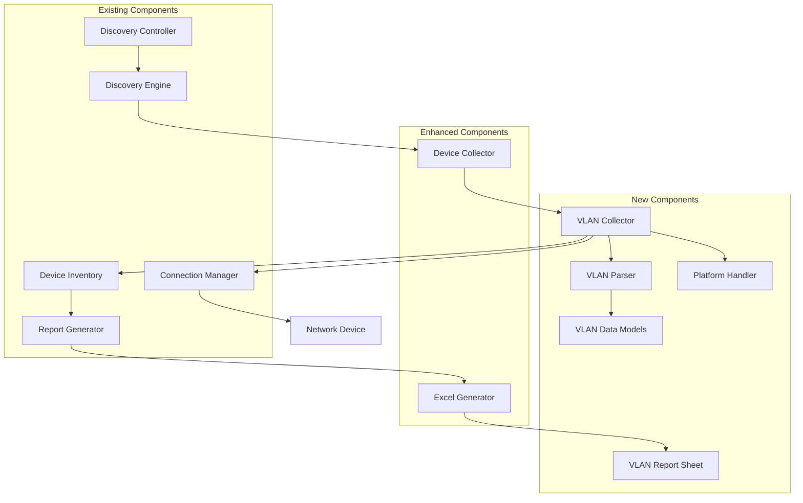

# Design Document: VLAN Inventory Collection

## Overview

The VLAN Inventory Collection feature extends NetWalker's network discovery capabilities by adding comprehensive VLAN information gathering and reporting. The system integrates seamlessly with the existing discovery process, executing platform-specific VLAN commands on each successfully discovered device, parsing the output to extract structured VLAN data, and generating a professional VLAN inventory spreadsheet within the existing inventory workbook.

The design follows NetWalker's established patterns for device information collection, command execution, and report generation. VLAN collection occurs as part of the device information gathering phase, with results stored in the device inventory and consolidated into a dedicated VLAN inventory sheet during report generation.

## Architecture

The VLAN inventory collection system integrates into NetWalker's existing architecture with minimal changes to core components:



### Integration Points

1. **Device Collector Enhancement**: Extended to call VLAN Collector after successful device information collection
2. **Excel Generator Enhancement**: Extended to create VLAN inventory sheets in existing workbooks
3. **Configuration Manager**: Enhanced to support VLAN collection configuration options
4. **Data Models**: Extended to include VLAN information structures

## Components and Interfaces

### VLAN Collector

**Purpose**: Orchestrates VLAN information collection from network devices using platform-appropriate commands.

**Key Methods**:
- `collect_vlan_information(connection, device_info)`: Main entry point for VLAN collection
- `execute_vlan_commands(connection, platform)`: Executes platform-specific VLAN commands
- `handle_collection_errors(device_info, error)`: Manages collection failures and logging

**Integration Pattern**:
```python
class VLANCollector:
    def __init__(self, config: Dict[str, Any]):
        self.config = config
        self.platform_handler = PlatformHandler()
        self.vlan_parser = VLANParser()
        self.logger = logging.getLogger(__name__)
        
    def collect_vlan_information(self, connection: Any, device_info: DeviceInfo) -> List[VLANInfo]:
        """Collect VLAN information from device"""
        if not self._is_vlan_collection_enabled():
            return []
            
        try:
            # Get platform-specific commands
            commands = self.platform_handler.get_vlan_commands(device_info.platform)
            
            # Execute VLAN commands
            vlan_output = self._execute_vlan_commands(connection, commands)
            
            # Parse VLAN information
            vlans = self.vlan_parser.parse_vlan_output(vlan_output, device_info.platform)
            
            # Add device context to each VLAN
            for vlan in vlans:
                vlan.device_hostname = device_info.hostname
                vlan.device_ip = device_info.primary_ip
                
            return vlans
            
        except Exception as e:
            self._handle_collection_error(device_info, e)
            return []
```

### Platform Handler

**Purpose**: Determines appropriate VLAN commands for different Cisco platforms and handles platform-specific variations.

**Key Methods**:
- `get_vlan_commands(platform)`: Returns platform-specific VLAN command list
- `validate_platform_support(platform)`: Checks if VLAN collection is supported
- `adapt_commands_for_platform(platform)`: Customizes commands for platform variations

**Platform Command Mapping**:
```python
class PlatformHandler:
    def __init__(self):
        self.platform_commands = {
            'IOS': ['show vlan brief'],
            'IOS-XE': ['show vlan brief'],
            'NX-OS': ['show vlan'],
            'Unknown': ['show vlan brief', 'show vlan']  # Try both
        }
        
    def get_vlan_commands(self, platform: str) -> List[str]:
        """Get VLAN commands for platform"""
        commands = self.platform_commands.get(platform, self.platform_commands['Unknown'])
        return commands.copy()
        
    def validate_platform_support(self, platform: str) -> bool:
        """Check if platform supports VLAN collection"""
        supported_platforms = ['IOS', 'IOS-XE', 'NX-OS']
        return platform in supported_platforms or platform == 'Unknown'
```

### VLAN Parser

**Purpose**: Parses VLAN command output to extract structured VLAN information including port and PortChannel counts.

**Key Methods**:
- `parse_vlan_output(output, platform)`: Main parsing method for VLAN command output
- `parse_ios_vlan_brief(output)`: Parses IOS/IOS-XE "show vlan brief" output
- `parse_nxos_vlan(output)`: Parses NX-OS "show vlan" output
- `count_ports_and_portchannels(port_list)`: Counts physical ports and PortChannels

**Parsing Strategy**:
```python
class VLANParser:
    def parse_vlan_output(self, output: str, platform: str) -> List[VLANInfo]:
        """Parse VLAN output based on platform"""
        if not output or not output.strip():
            return []
            
        if platform in ['IOS', 'IOS-XE']:
            return self._parse_ios_vlan_brief(output)
        elif platform == 'NX-OS':
            return self._parse_nxos_vlan(output)
        else:
            # Try both parsers for unknown platforms
            vlans = self._parse_ios_vlan_brief(output)
            if not vlans:
                vlans = self._parse_nxos_vlan(output)
            return vlans
    
    def _parse_ios_vlan_brief(self, output: str) -> List[VLANInfo]:
        """Parse IOS/IOS-XE show vlan brief output"""
        vlans = []
        lines = output.split('\n')
        
        # Skip header lines and find data section
        data_started = False
        for line in lines:
            line = line.strip()
            if not line:
                continue
                
            # Skip headers
            if 'VLAN Name' in line or '----' in line:
                data_started = True
                continue
                
            if not data_started:
                continue
                
            # Parse VLAN line: "1    default                          active    Fa0/1, Fa0/2, Po1"
            vlan_match = re.match(r'^(\d+)\s+(\S+)\s+\S+\s+(.*)$', line)
            if vlan_match:
                vlan_id = int(vlan_match.group(1))
                vlan_name = vlan_match.group(2)
                ports_str = vlan_match.group(3).strip()
                
                # Count ports and PortChannels
                port_count, portchannel_count = self._count_ports_and_portchannels(ports_str)
                
                vlan_info = VLANInfo(
                    vlan_id=vlan_id,
                    vlan_name=vlan_name,
                    port_count=port_count,
                    portchannel_count=portchannel_count,
                    device_hostname="",  # Will be set by collector
                    device_ip=""  # Will be set by collector
                )
                vlans.append(vlan_info)
                
        return vlans
```

### VLAN Report Generator

**Purpose**: Creates VLAN inventory spreadsheet within existing NetWalker workbooks using established formatting standards.

**Key Methods**:
- `create_vlan_inventory_sheet(workbook, vlan_data)`: Creates VLAN inventory sheet
- `format_vlan_sheet(worksheet)`: Applies professional formatting
- `consolidate_vlan_data(inventory)`: Consolidates VLAN data from all devices

**Sheet Integration**:
```python
def create_vlan_inventory_sheet(self, workbook: Workbook, inventory: Dict[str, Dict[str, Any]]):
    """Create VLAN inventory sheet in existing workbook"""
    ws = workbook.create_sheet("VLAN Inventory")
    
    # Headers matching requirements
    headers = [
        "Device Name", "VLAN Number", "VLAN Name", 
        "Port Count", "PortChannel Count"
    ]
    
    # Apply header formatting
    for col, header in enumerate(headers, 1):
        cell = ws.cell(row=1, column=col, value=header)
        self._apply_header_style(cell)
    
    # Consolidate VLAN data from all devices
    all_vlans = self._consolidate_vlan_data(inventory)
    
    # Populate VLAN data
    row = 2
    for vlan in all_vlans:
        ws.cell(row=row, column=1, value=vlan.device_hostname)
        ws.cell(row=row, column=2, value=vlan.vlan_id)
        ws.cell(row=row, column=3, value=vlan.vlan_name)
        ws.cell(row=row, column=4, value=vlan.port_count)
        ws.cell(row=row, column=5, value=vlan.portchannel_count)
        row += 1
    
    # Create table and apply formatting
    if row > 2:
        table_range = f"A1:{get_column_letter(len(headers))}{row-1}"
        table = Table(displayName="VLANInventory", ref=table_range)
        table.tableStyleInfo = TableStyleInfo(
            name="TableStyleMedium9", showFirstColumn=False,
            showLastColumn=False, showRowStripes=True, showColumnStripes=True
        )
        ws.add_table(table)
    
    # Auto-size columns
    self._auto_size_columns(ws)
```

## Data Models

### Core VLAN Data Structures

```python
@dataclass
class VLANInfo:
    """VLAN information collected from a device"""
    vlan_id: int
    vlan_name: str
    port_count: int
    portchannel_count: int
    device_hostname: str
    device_ip: str
    collection_timestamp: Optional[datetime] = None
    collection_error: Optional[str] = None

@dataclass
class VLANCollectionResult:
    """Result of VLAN collection operation"""
    device_hostname: str
    device_ip: str
    vlans: List[VLANInfo]
    collection_success: bool
    collection_timestamp: datetime
    error_details: Optional[str] = None

@dataclass
class VLANCollectionConfig:
    """Configuration for VLAN collection"""
    enabled: bool = True
    command_timeout: int = 30
    max_retries: int = 2
    include_inactive_vlans: bool = True
    platforms_to_skip: List[str] = None
```

### Enhanced Device Information

```python
# Extension to existing DeviceInfo class
@dataclass
class DeviceInfo:
    # ... existing fields ...
    vlans: List[VLANInfo] = field(default_factory=list)
    vlan_collection_status: str = "not_attempted"  # not_attempted, success, failed, skipped
    vlan_collection_error: Optional[str] = None
```

Now I need to use the prework tool to analyze the acceptance criteria before writing the correctness properties:

<function_calls>
<invoke name="prework">
<parameter name="featureName">vlan-inventory-collection

## Correctness Properties

*A property is a characteristic or behavior that should hold true across all valid executions of a system-essentially, a formal statement about what the system should do. Properties serve as the bridge between human-readable specifications and machine-verifiable correctness guarantees.*

After analyzing the acceptance criteria, I've identified the following testable properties that can be validated through property-based testing:

### VLAN Collection Properties

**Property 1: Automatic VLAN Collection Initiation**
*For any* successfully discovered device, VLAN collection should be automatically initiated for that device
**Validates: Requirements 1.1**

**Property 2: Platform-Specific Command Selection**
*For any* device with a known platform (IOS/IOS-XE/NX-OS), the correct platform-specific VLAN command should be selected
**Validates: Requirements 1.2**

**Property 3: VLAN Information Extraction Completeness**
*For any* successful VLAN command execution, all available VLAN information should be extracted from the command output
**Validates: Requirements 1.3**

**Property 4: Error Isolation and Continuation**
*For any* VLAN command execution failure, the system should log the failure and continue processing remaining devices
**Validates: Requirements 1.4**

**Property 5: Device Association Completeness**
*For any* collected VLAN entry, the source device information should be properly recorded and associated
**Validates: Requirements 1.5**

### Platform Handler Properties

**Property 6: Unknown Platform Fallback Behavior**
*For any* device with unknown or undetected platform, both command variants should be attempted and the successful one used
**Validates: Requirements 2.3**

**Property 7: Unsupported Device Handling**
*For any* device that doesn't support VLAN commands, the limitation should be logged and VLAN collection skipped for that device
**Validates: Requirements 2.4**

**Property 8: Privilege Error Handling**
*For any* command execution that fails due to insufficient privileges, the access issue should be logged without exposing credentials and processing should continue
**Validates: Requirements 2.5**

### VLAN Parser Properties

**Property 9: Complete VLAN Data Extraction**
*For any* valid VLAN command output, VLAN number, VLAN name, and port assignment information should be extracted
**Validates: Requirements 3.1**

**Property 10: Physical Port Count Accuracy**
*For any* VLAN with port assignments, the count of physical ports should be accurate and non-negative
**Validates: Requirements 3.2**

**Property 11: PortChannel Count Accuracy**
*For any* VLAN with PortChannel assignments, the count of PortChannel interfaces should be accurate and non-negative
**Validates: Requirements 3.3**

**Property 12: Status Field Exclusion**
*For any* VLAN command output containing status information, status fields should be ignored during parsing
**Validates: Requirements 3.4**

**Property 13: Parsing Error Recovery**
*For any* malformed or unexpected VLAN output format, parsing errors should be logged and processing should continue with remaining VLANs
**Validates: Requirements 3.5**

### Report Generation Properties

**Property 14: VLAN Data Row Organization**
*For any* collected VLAN data, each VLAN should be listed as a separate row with its associated device information
**Validates: Requirements 4.3**

**Property 15: Professional Formatting Consistency**
*For any* generated VLAN inventory sheet, formatting should match the professional standards of existing NetWalker reports
**Validates: Requirements 4.4**

### Integration Properties

**Property 16: Non-Blocking VLAN Collection**
*For any* VLAN collection operation in progress, other discovery tasks should continue without blocking
**Validates: Requirements 5.2**

**Property 17: Report Integration Completeness**
*For any* completed discovery session, VLAN reports should be generated as part of the standard report generation process
**Validates: Requirements 5.3**

**Property 18: Graceful Partial Failure Handling**
*For any* discovery session where VLAN collection fails for some devices, the system should complete normally and include partial VLAN data in reports
**Validates: Requirements 5.4**

### Error Handling and Logging Properties

**Property 19: Command Failure Logging Completeness**
*For any* VLAN command execution failure, specific error details and device information should be logged
**Validates: Requirements 6.1**

**Property 20: Parsing Error Logging and Continuation**
*For any* parsing error, the problematic output should be logged and processing should continue
**Validates: Requirements 6.2**

**Property 21: Unsupported Device Logging**
*For any* device that doesn't support VLAN commands, the device platform and limitation should be logged
**Validates: Requirements 6.3**

**Property 22: Secure Authentication Error Logging**
*For any* authentication failure during VLAN collection, access problems should be logged without exposing credentials
**Validates: Requirements 6.4**

**Property 23: Collection Summary Logging**
*For any* completed VLAN collection session, summary statistics including successful and failed collections should be logged
**Validates: Requirements 6.5**

### Configuration Properties

**Property 24: Timeout Configuration Application**
*For any* configured VLAN collection timeout value, the timeout should be applied to VLAN command execution
**Validates: Requirements 7.2**

**Property 25: Disabled Collection Behavior**
*For any* configuration where VLAN collection is disabled, all VLAN-related processing should be skipped during discovery
**Validates: Requirements 7.3**

**Property 26: CLI Override Functionality**
*For any* CLI option provided for VLAN collection, the command line setting should override configuration file settings
**Validates: Requirements 7.5**

### Performance Properties

**Property 27: Concurrent Collection Support**
*For any* multiple device VLAN collection operation, concurrent collection should be supported without interference
**Validates: Requirements 8.1**

**Property 28: Resource Constraint Compliance**
*For any* VLAN collection operation, existing connection limits and thread pool constraints should be respected
**Validates: Requirements 8.2**

**Property 29: Timeout Enforcement**
*For any* VLAN command that exceeds expected execution time, appropriate timeouts should be applied to prevent hanging
**Validates: Requirements 8.3**

**Property 30: Resource Cleanup Completeness**
*For any* completed VLAN collection operation, all resources and connections should be properly released
**Validates: Requirements 8.5**

### Data Validation Properties

**Property 31: VLAN ID Range Validation**
*For any* extracted VLAN number, the value should be within the valid range (1-4094)
**Validates: Requirements 9.1**

**Property 32: VLAN Name Character Handling**
*For any* extracted VLAN name, special characters and encoding issues should be handled appropriately
**Validates: Requirements 9.2**

**Property 33: Port Count Non-Negative Validation**
*For any* calculated port count, the value should be a non-negative integer
**Validates: Requirements 9.3**

**Property 34: Duplicate VLAN Entry Handling**
*For any* device with duplicate VLAN entries, duplications should be logged and all entries included
**Validates: Requirements 9.4**

**Property 35: Inconsistent Data Warning**
*For any* VLAN data that appears inconsistent, warnings should be logged but data should be included for manual review
**Validates: Requirements 9.5**

### Reporting Integration Properties

**Property 36: Main Report VLAN Sheet Inclusion**
*For any* generated main discovery report, the VLAN inventory sheet should be included
**Validates: Requirements 10.1**

**Property 37: Site-Specific VLAN Data Inclusion**
*For any* generated site-specific report, VLAN data for devices within that site boundary should be included
**Validates: Requirements 10.2**

**Property 38: Per-Seed VLAN Data Inclusion**
*For any* generated per-seed report, VLAN data for devices discovered by that seed should be included
**Validates: Requirements 10.3**

**Property 39: Master Inventory VLAN Consolidation**
*For any* master inventory report creation, VLAN data from all discovery sessions should be consolidated
**Validates: Requirements 10.4**

**Property 40: VLAN Sheet Formatting Standards**
*For any* VLAN inventory sheet, formatting should match the standards of other NetWalker report sheets
**Validates: Requirements 10.5**

## Error Handling

The VLAN inventory collection system implements comprehensive error handling to ensure robust operation across diverse network environments:

### Command Execution Error Handling
- **VLAN Command Failures**: Graceful handling of command execution failures with detailed logging
- **Platform Detection Failures**: Fallback to trying multiple command variants for unknown platforms
- **Authentication Failures**: Secure error logging without credential exposure
- **Timeout Handling**: Configurable command timeouts with graceful failure recovery
- **Privilege Issues**: Proper handling of insufficient privilege errors with continued processing

### Parsing Error Handling
- **Malformed Output**: Graceful handling of unexpected VLAN command output formats
- **Encoding Issues**: Proper handling of special characters and encoding problems in VLAN names
- **Data Validation Failures**: Validation of VLAN IDs, port counts, and other extracted data
- **Incomplete Data**: Handling of partial or incomplete VLAN information
- **Duplicate Entries**: Detection and logging of duplicate VLAN entries on the same device

### Integration Error Handling
- **Collection Failures**: Isolation of VLAN collection failures from main discovery process
- **Report Generation Errors**: Graceful handling of VLAN sheet creation failures
- **Configuration Errors**: Validation and fallback for invalid VLAN collection configuration
- **Resource Exhaustion**: Proper handling of memory and connection resource limitations
- **Concurrent Processing Errors**: Thread safety and error isolation in concurrent operations

### Recovery Strategies
- **Partial Success Handling**: Include successfully collected VLAN data even when some devices fail
- **Retry Logic**: Configurable retry attempts for transient failures
- **Fallback Mechanisms**: Multiple parsing strategies for different output formats
- **Graceful Degradation**: Continue discovery process even when VLAN collection fails entirely

## Testing Strategy

The VLAN Inventory Collection feature employs a comprehensive dual testing approach combining unit tests for specific scenarios and property-based tests for universal correctness validation.

### Property-Based Testing Framework

**Framework Selection**: The system uses the `hypothesis` library for Python property-based testing, providing robust input generation and shrinking capabilities for effective bug discovery.

**Test Configuration**:
- Minimum 100 iterations per property test to ensure comprehensive input coverage
- Custom generators for VLAN-specific data types (VLAN IDs, device platforms, command outputs)
- Shrinking enabled to find minimal failing examples
- Deterministic seed support for reproducible test runs

**Property Test Implementation**:
Each correctness property is implemented as a dedicated property-based test with the following structure:

```python
@given(devices=device_list_generator(), platforms=platform_generator())
def test_platform_specific_command_selection(devices, platforms):
    """
    Feature: vlan-inventory-collection, Property 2: Platform-Specific Command Selection
    For any device with a known platform (IOS/IOS-XE/NX-OS), the correct 
    platform-specific VLAN command should be selected
    """
    platform_handler = PlatformHandler()
    
    for device in devices:
        if device.platform in ['IOS', 'IOS-XE', 'NX-OS']:
            commands = platform_handler.get_vlan_commands(device.platform)
            
            # Verify correct command selection
            if device.platform in ['IOS', 'IOS-XE']:
                assert 'show vlan brief' in commands
            elif device.platform == 'NX-OS':
                assert 'show vlan' in commands
```

### Unit Testing Strategy

**Framework**: Uses `pytest` for unit testing with comprehensive fixture support and parameterized testing capabilities.

**Test Categories**:
- **VLAN Parser Tests**: Verify accurate parsing of various VLAN command outputs
- **Platform Handler Tests**: Validate command selection logic for different platforms
- **Integration Tests**: Verify interaction between VLAN collection and existing components
- **Error Handling Tests**: Ensure proper handling of various failure scenarios
- **Configuration Tests**: Validate VLAN collection configuration options
- **Report Generation Tests**: Verify VLAN sheet creation and formatting

**Real Device Testing Strategy**:
- Use real network devices for testing when available to ensure authentic VLAN output parsing
- Maintain a test lab environment with actual Cisco devices for comprehensive validation
- Fall back to mock objects only when real devices are unavailable
- Test with actual VLAN configurations to ensure parsing accuracy
- Validate report generation with real VLAN data

### Test Data Generation

**VLAN Output Generators**:
```python
@composite
def vlan_output_generator(draw, platform='IOS'):
    """Generate realistic VLAN command outputs for testing"""
    num_vlans = draw(integers(min_value=1, max_value=50))
    vlans = []
    
    for i in range(num_vlans):
        vlan_id = draw(integers(min_value=1, max_value=4094))
        vlan_name = draw(text(alphabet=string.ascii_letters + string.digits + '-_', 
                            min_size=1, max_size=32))
        
        # Generate port assignments
        num_ports = draw(integers(min_value=0, max_value=20))
        ports = [f"Fa0/{i}" for i in range(num_ports)]
        
        # Generate PortChannel assignments
        num_portchannels = draw(integers(min_value=0, max_value=5))
        portchannels = [f"Po{i}" for i in range(num_portchannels)]
        
        vlans.append({
            'id': vlan_id,
            'name': vlan_name,
            'ports': ports,
            'portchannels': portchannels
        })
    
    return format_vlan_output(vlans, platform)

@composite
def device_generator(draw):
    """Generate realistic device information for testing"""
    hostname = draw(text(alphabet=string.ascii_letters + string.digits + '-', 
                        min_size=1, max_size=36))
    platform = draw(sampled_from(['IOS', 'IOS-XE', 'NX-OS', 'Unknown']))
    ip_address = draw(ip_addresses(v=4))
    
    return DeviceInfo(
        hostname=hostname,
        platform=platform,
        primary_ip=str(ip_address),
        # ... other required fields
    )
```

**Error Condition Generators**:
- Malformed VLAN output generators for testing parsing robustness
- Authentication failure simulators for testing error handling
- Timeout condition generators for testing timeout enforcement
- Resource exhaustion simulators for testing resource management

### Integration Testing

**End-to-End Testing**:
- Complete VLAN collection workflows with mock network environments
- Integration with existing discovery process validation
- Report generation with VLAN data validation
- Configuration option testing with various input combinations

**Performance Testing**:
- Concurrent VLAN collection handling with load simulation
- Memory usage validation during large network VLAN collection
- Command timeout enforcement under various network conditions
- Resource cleanup validation after collection completion

### Test Execution and Reporting

**Continuous Integration**:
- Automated test execution on code changes
- Property-based test failure analysis with shrinking reports
- Coverage reporting with minimum 90% code coverage requirement for new VLAN components
- Performance regression detection for VLAN collection operations

**Test Organization**:
```
tests/
├── unit/
│   ├── test_vlan_collector.py
│   ├── test_platform_handler.py
│   ├── test_vlan_parser.py
│   └── test_vlan_report_generator.py
├── property/
│   ├── test_vlan_collection_properties.py
│   ├── test_vlan_parsing_properties.py
│   ├── test_vlan_reporting_properties.py
│   └── test_vlan_integration_properties.py
├── integration/
│   ├── test_vlan_discovery_integration.py
│   ├── test_vlan_configuration_integration.py
│   └── test_vlan_report_integration.py
└── fixtures/
    ├── sample_vlan_outputs.py
    ├── mock_vlan_devices.py
    └── vlan_test_data.py
```

This comprehensive testing strategy ensures that the VLAN Inventory Collection feature maintains high reliability and correctness across diverse network environments while providing rapid feedback during development and seamless integration with existing NetWalker functionality.